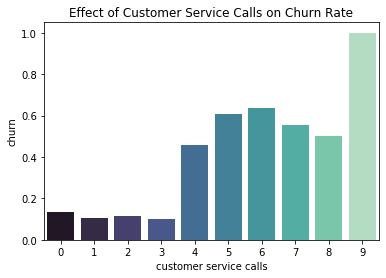
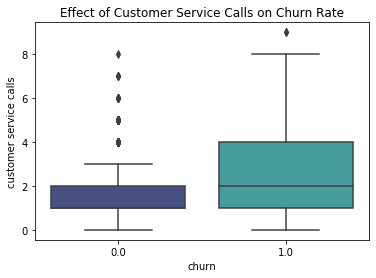
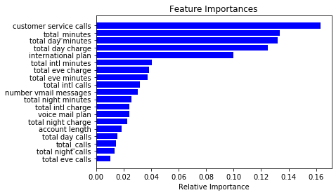
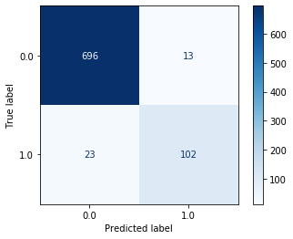

# Module 3 Final Project readme

In this project we will build a classification model to predict whether or not a customer will churn, or stop doing business with SyriaTel, a mobile network provider.  We will explore, clean and feature engineer our dataset and iteratively model our data using and tuning machine learning algorithms to build a classifier suited for the best predictions for the business problem at hand.

## Goals

* Interpret our data, feature engineer and scale as necessary to create the best possible framework for modeling
* Visualize some of the most important features, understand the business problem and use our classifier as a baseline for tangible solutions
* Iterate through several models and parameters with a focus on recall, minimizing false negatives as best as our models are able

## Methodologies

* Identify predictor variables and visualize relationships to target variable ('churn')
* Create baseline model using Random Forest Classifier, Pipeline, and GridSearchCV, adjust hyperparameters to maximize recall score
* Iterate through Logistic Regression, Gradient Boosting, AdaBoost, and K-Nearest Neighbors models, adjusting fits and scaling data where necessary
* Create dummy variables for comparitive modeling on best-performing models
* Build two comparable well-performing models using Random Forest and Gradient Boosting classifiers
* Identify most important features from final model

### Which features were most important in our models?

During the EDA process, customer service calls stood out as having an effect on churn and this continued when we plotted feature importance of our models.  Churn rate by state could be looked at as part of future work to remove outliers and identify the characteristics of certain states which churn more frequently.

### What was the thought process during modeling with each algorithm?

Focusing mainly on recall but paying attention to other scoring metrics such as precision and accuracy of model, we built confusion matrices for each iteration of our model and focused on minimizing our false negatives; in practical terms, the occurances where our model will falsely predict that a customer is remaining when they are in fact churning.  For our two best-performing classifiers - Random Forest and Gradient Boosting - we used GridSearchCV to tune our hyperparameters and LIME to help visualize feature importances for future work and business recommendations.